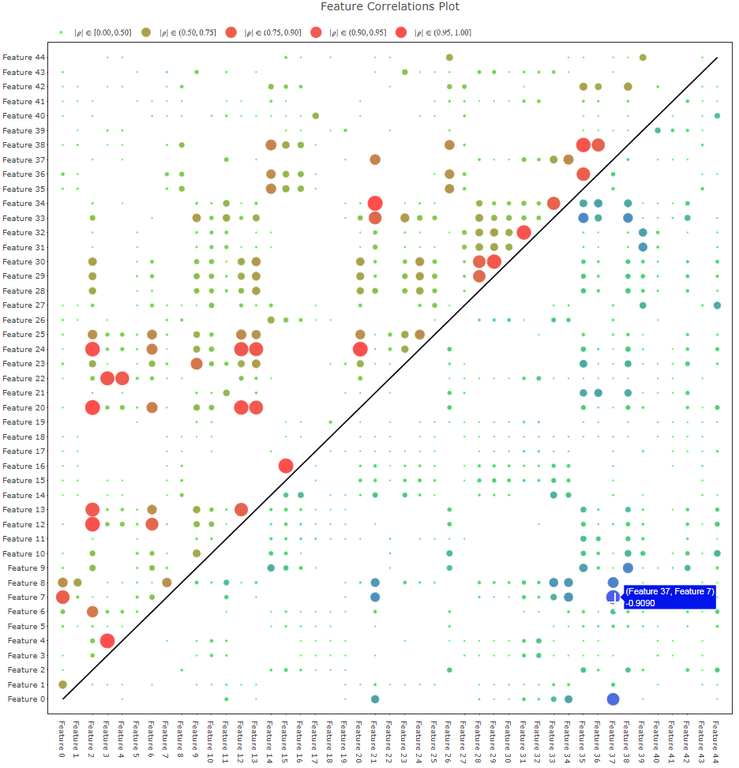

# Feature Correlations Plot

In any machine learning endeavor, it is important for the data scientist to inspect the cross-correlations between the features used as inputs. Depending on the modeling technique used, high multicolinearity can:

- induce numerical instability
- inflate model variance
- impede model specification & interpretation

A *correlation matrix* is a symmetric `p x p` (if there are `p` features) matrix holding all pairwise correlations. It is an important tool for the data scientist to identify any multicollinearity in a set of features. However, for large `p` - which is more and more common - thorough review of the correlation matrix can be an onerous task. Instead of reviewing the actual matrix, a visualization such as a *heat map* is often used (e.g. [here](http://www.sthda.com/english/wiki/ggplot2-quick-correlation-matrix-heatmap-r-software-and-data-visualization)).

I've developed a correlation matrix visualization tool which simplifies interpretation, relative to existing visualizations. The *Feature Correlations Plot* is a  bubble plot, wherein the sizes of the bubbles are proportional to the absolute magnitude of the correlations. One shortcoming of most correlation matrix visualization tools is how they handle the duplication of data due to the symmetricity of correlations. They either keep the duplicated information, or simply draw on one triangle. To declutter the visualization, the Feature Correlations Plot removes the duplicate correlations. Positive correlations are only plotted in the upper triangle, with colors ranging from green (`0`) to red (`+1`). Negative correlations are plotted in the lower triangle, with colors ranging from green (`0`) to blue (`-1`). Perfect correlations are indicated with black bubbles. The perfect self-correlations on the diagonal are omitted, as they add no information. The design of the Feature Correlations Plot makes it easy to identify and filter for large correlations, and it is trivial to identify which features are positively vs. negatively correlated. I have developed it as an interactive visualization using the open source python package [plot.ly](https://plot.ly).

The [FeatureCorrelationsPlot](FeatureCorrelationsPlot.ipynb) jupyter notebook holds the function that generates the Feature Correlations Plot. There are also two demonstrative examples with simulated data, and a 3rd example with real-world data.
